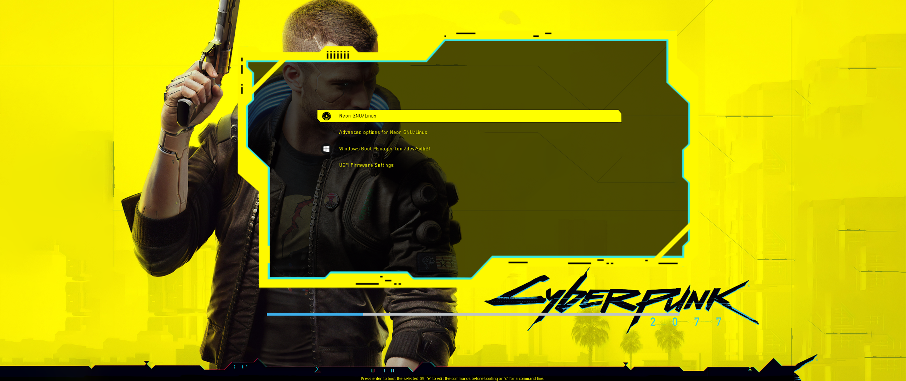

# Cyberpunk Theme for GRUB Bootloader
A GRUB Bootloader Theme Inspired by Cyberpunk 2077.
Thanks to @anoopmsivadas and NayamAmarshe for making this theme. I've changed the theme to work for 21:9 ultrawide displays without stretching it out.

## Features
- Fully automated
- Recognizes other OS installations
- Appropriate icons for almost every OS
- Ultrawide ftw


NOTE: Tested on 2560x1080 resolution.

# Install

### Download the git package, if it isn't already installed

### Arch Linux
```shell
sudo pacman -S git
```

### Debian
```shell
sudo apt update
sudo apt install git
```

### Gentoo
Add the following USE flags in /etc/portage/make.conf
```shell
blksha1 cgi curl cvs doc emacs gnome-keyring gpg highlight iconv mediawiki mediawiki-experimental nls pcre perforce perl ppcsha1 selinux subversion test threads tk webdav xinetd
```
Install the package
```shell
sudo emerge --ask dev-vcs/git
```

### Fedora
```shell
sudo dnf -y update
sudo dnf -y install git
```

### OpenSUSE
```shell
sudo zypper in git-core
```


## Clone the repo and install the GRUB theme

```shell
git clone https://github.com/AlpinDale/Cyberpunk-GRUB-Theme.git && cd Cyberp*
sudo ./install.sh
```


